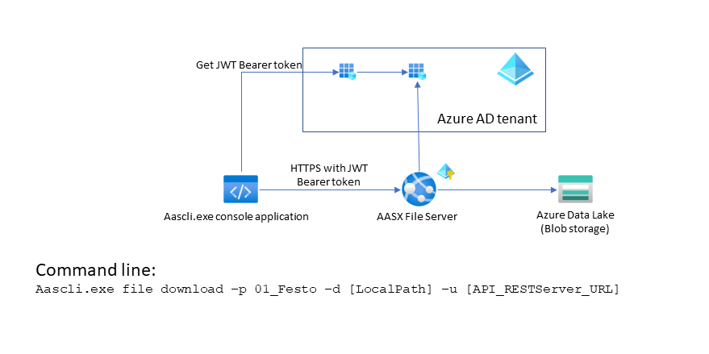

# Open Digital Twins - Asset Administration Shell - Command line



**Attention: Work in progress** 

Sample command line daemon application that can call 
[AAS API Rest servers](https://github.com/JMayrbaeurl/opendigitaltwins-aas-azureservices). Currently supported:

| AAS API Interface | Supported by version |
| --- | --- |
| AASX File Server | v0.0.1 |
| Discovery Server | n.a. |
| Shell Repository | n.a. |
| Registry Server | n.a. |

## Configuration

Application settings are stored in the local file 'appsettings.json' that's located in the application's folder.

```json
{
  "Logging": {
    "LogLevel": {
      "Default": "Warning",
      "Microsoft": "Warning",
      "AAS.CLI": "Information"
    },
    "Debug": {
      "LogLevel": {
        "Default": "Information",
        "AAS.CLI": "Trace"
      }
    }
  },
  "ClientId": "Enter here",
  "ClientSecret": "Enter here",
  "ClientCertificateThumbprint": "Enter here",
  "ValidateClientCertificate" :  false,
  "Authority": "Enter here",
  "Scope":  "Enter here"
}
```

### Security configuration
AAS REST API Servers are expecting a JWT Bearer token in the Authorization header of HTTP requests. Azure AD is used to 
generate these tokens. Therefore an App registration for the AAS command line app with the appropriate access permissions 
has to be created. See Powershell script 'createADSetup.ps1' in the folder './scripts/azuredeployment'. The script outputs the 
Client Id, the Client secret and the Scope for the application settings file. Authority looks like
 `https://login.microsoftonline.com/[your directory tenant id]`

Using X509 certificates for authentication is supported, too. The script 'create_ClientCred_Cert.ps1' in the folder './scripts/azuredeployment'
shows how to create a self signed certificate. You will have to add a client secret in Azure AD with the file generated in 
'C:\Users\[username]\OneDrive - Microsoft\Documents\Certs' and set the 'ClientCertificateThumbprint' in the appsettings.json 
file accordingly. And make sure to not specifiy 'ClientSecret' in the appsettings.json file.

## AASX File Server support

**Basic usage**
```
aascli file subcommand [options]
```

| Command line syntax | AAS Interface operation |
| --- | --- |
| `aascli file list-all` | GetAllAASXPackageIds |
| `aascli file create` | PostAASXPackage |
| `aascli file delete` | DeleteAASXPackageById |
| `aascli file update` | PutAASXPackage |
| `aascli file download` | GetAASXByPackageId |

**Global Parameters**

`--url -u`

Url of the AASX File Server instance. E.g. `https://[your]aasapi.azurewebsites.net`

### aascli file list-all - Operation GetAllAASXPackageIds

Returns a list of available AASX packages at the server

```
aascli file list-all [--aasId] --url
```
**Examples**

Return all available AASX packages
```
aascli file list-all --u https://[your]aasapi.azurewebsites.net
```

Return all AASX packages that match the specified AAS identifier aasId
```
aascli file list-all --aasId '{aasId}' -u https://[your]aasapi.azurewebsites.net
```
**Required Parameters**

None

**Optional Parameters**

`--aasId -i`

AAS Ids which all must be in each matching AASX package

### aascli file create - Operation PostAASXPackage

TBD

```
aascli file create --aasId --file --url
```
**Examples**

**Required Parameters**

None

**Optional Parameters**

None

### aascli file delete - Operation DeleteAASXPackageById

TBD

```
aascli file delete
```
**Examples**

**Required Parameters**

None

**Optional Parameters**

None

### aascli file update - Operation PutAASXPackage

TBD

```
aascli file update
```
**Examples**

**Required Parameters**

None

**Optional Parameters**

None

### aascli file download - Operation GetAASXByPackageId

TBD

```
aascli file download
```
**Examples**

**Required Parameters**

None

**Optional Parameters**

None